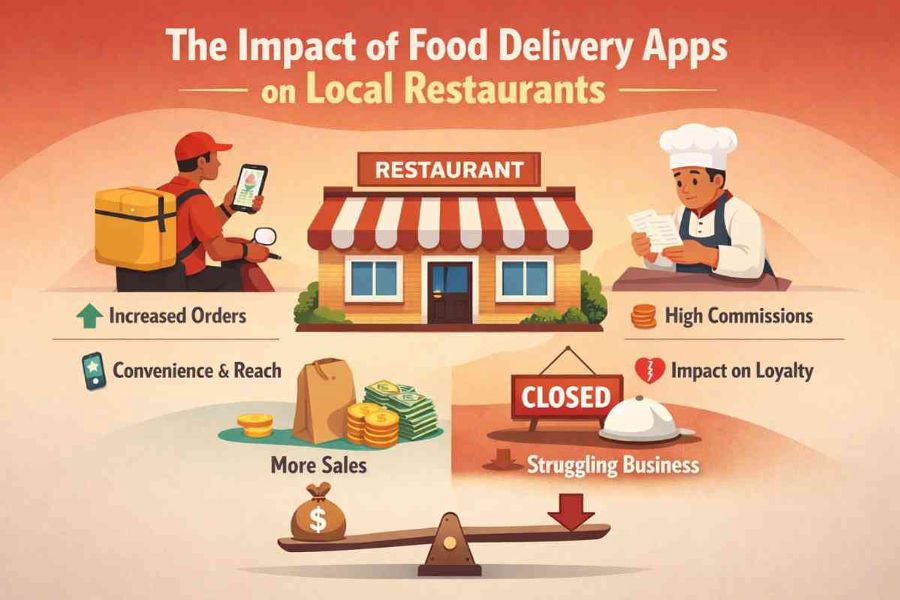

Food delivery apps have transformed the way people order and enjoy food. Over the past decade, platforms such as online food delivery services and restaurant apps have become an essential part of the modern food industry. Customers can now browse menus, place orders, and receive meals at their doorstep within minutes.
 
While this technology has created convenience for consumers, it has also significantly influenced how local restaurants operate, compete, and grow.
 
For many restaurants, food delivery apps have opened the door to a wider customer base and increased visibility. At the same time, these platforms have introduced challenges such as high commission fees, increased competition, and operational changes. As a result, the relationship between food delivery apps and local restaurants is complex, offering both opportunities and obstacles.
 
Below is a detailed exploration of the impact of [**food delivery apps**](https://app-clone.com/food-delivery-empire-with-a-swiggy-clone-app/) on local restaurants, including the benefits, challenges, and long-term effects on the restaurant industry.
 
---
 
## 1. Increased Visibility and Customer Reach
 
One of the most significant advantages of food delivery apps for local restaurants is the ability to reach a broader audience. In the past, restaurants relied mainly on foot traffic, local advertising, and word-of-mouth to attract customers. Today, delivery apps allow them to connect with thousands of potential customers through a single digital platform.
 
Food delivery apps act as an online marketplace where customers can easily browse restaurants, compare menus, read reviews, and place orders. This digital exposure allows small or newly opened restaurants to compete with larger chains by showcasing their dishes to a wider audience.
 
Many restaurants report increased customer traffic after joining delivery platforms because their menu becomes accessible to people who may never have visited their physical location.
 
Studies show that joining food delivery platforms can expand a restaurant’s geographical reach and bring in new customers from outside their immediate neighborhood.
 
---
 
## 2. Additional Revenue Opportunities
 
Food delivery apps have also created new revenue streams for restaurants. By offering delivery services through these platforms, restaurants can generate income beyond traditional dine-in sales.
 
For example, many customers prefer ordering food from home or the workplace instead of visiting restaurants. Delivery apps make it possible for restaurants to capture these customers without building their own delivery infrastructure.
 
During times of crisis, such as the COVID-19 pandemic, food delivery platforms played a crucial role in helping restaurants survive when dine-in services were restricted.
 
In addition, delivery apps help restaurants operate for longer hours, allowing customers to place orders late at night or during off-peak periods.
 
---
 
## 3. Digital Transformation of Local Restaurants
 
The rise of food delivery apps has pushed many local restaurants to adopt digital technologies. Restaurants now rely on:
 
- Digital menus  
- Online order management systems  
- Integrated payment platforms  
 
Many restaurants have implemented **Point-of-Sale (POS) systems** that integrate with delivery apps to manage orders automatically.
 
Technology also enables restaurants to analyze customer behavior and preferences. For example, they can track:
 
- Popular menu items  
- Peak ordering times  
- Successful promotions  
 
These insights help restaurants optimize menus, pricing, and marketing strategies.
 
---
 
## 4. Increased Competition Among Restaurants
 
While food delivery apps provide exposure, they also intensify competition. Customers can easily compare dozens of restaurants offering similar cuisines within seconds.
 
This competitive environment pushes restaurants to stand out through:
 
- Attractive menus  
- Competitive pricing  
- Positive ratings and reviews  
 
However, smaller restaurants may struggle to compete with well-known brands that have larger marketing budgets.
 
To remain competitive, many businesses offer discounts and promotions, which can increase orders but reduce profit margins.
 
---
 
## 5. High Commission Fees and Reduced Profit Margins
 
One of the biggest concerns for restaurants using delivery apps is the commission charged by the platforms.
 
Most platforms charge restaurants **15%–30% per order**, which can significantly affect profitability.
 
Since restaurants often operate on thin margins, these fees may reduce earnings considerably. Some restaurants respond by increasing menu prices on delivery apps to compensate for these costs.
 
However, price differences between in-store and online menus may lead to customer dissatisfaction.
 
---
 
## 6. Price Differences and Customer Perception
 
Because of platform commissions, restaurants frequently adjust menu prices on delivery apps.
 
Customers may also encounter additional charges such as:
 
- Delivery fees  
- Packaging fees  
- Platform service charges  
 
These added costs can increase the total bill compared to dining in.
 
While many customers accept higher prices in exchange for convenience, others may become frustrated with the cost differences.
 
---
 
## 7. Changes in Restaurant Operations
 
Food delivery apps have significantly changed restaurant operations. Businesses must now manage both dine-in and delivery orders simultaneously.
 
Many restaurants have created dedicated kitchen areas for delivery orders.
 
Staff responsibilities include:
 
- Accurate order preparation  
- Careful packaging  
- Fast preparation times  
 
Proper packaging has become crucial to ensure food quality during transport and avoid negative reviews.
 
---
 
## 8. Growth of Cloud Kitchens and Virtual Restaurants
 
Food delivery apps have also contributed to the rise of **cloud kitchens** (also called ghost kitchens or virtual kitchens).
 
These are commercial kitchens designed specifically for delivery orders and do not offer dine-in services.
 
Advantages include:
 
- Lower rent costs  
- Reduced staffing needs  
- Ability to test new menu concepts  
 
However, cloud kitchens also increase competition for traditional restaurants because they operate efficiently and focus entirely on delivery.
 
---
 
## 9. Influence on Customer Behavior
 
Food delivery apps have significantly changed consumer expectations. Modern customers expect:
 
- Quick ordering  
- Fast delivery  
- Real-time tracking  
- Personalized recommendations  
 
These platforms also encourage customers to explore new restaurants rather than remaining loyal to a single establishment.
 
For restaurants, this means maintaining strong ratings and positive customer reviews is more important than ever.
 
---
 
## 10. Long-Term Impact on the Restaurant Industry
 
Food delivery apps have permanently reshaped the restaurant industry.
 
Many restaurants now treat delivery platforms as essential marketing and sales channels.
 
At the same time, businesses are experimenting with hybrid models that combine:
 
- Dine-in services  
- Third-party delivery platforms  
- Direct ordering through their own apps or websites  
 
In the future, restaurants may focus more on building direct relationships with customers while still using delivery platforms for visibility.
 
---
 
## Conclusion
 
Food delivery apps have revolutionized the restaurant industry by changing how customers discover, order, and enjoy food.
 
For local restaurants, these platforms offer opportunities to increase visibility, attract new customers, and generate additional revenue.
 
However, the rise of [**food delivery apps**](https://app-clone.com/food-delivery-empire-with-a-swiggy-clone-app/) also brings challenges such as high commission fees, increased competition, and operational adjustments.
 
Restaurants that balance the advantages of digital platforms with sustainable business strategies are more likely to succeed in the evolving food industry.
 
---
 
## FAQs
 
### 1. How do food delivery apps benefit local restaurants?
 
Food delivery apps help restaurants reach a wider audience, increase visibility, and generate additional revenue through online orders.
 
### 2. What challenges do restaurants face when using food delivery apps?
 
Common challenges include high commission fees, intense competition, operational adjustments, and pressure to offer discounts.
 
### 3. Why are food prices sometimes higher on delivery apps?
 
Restaurants often increase prices on delivery platforms to offset commission fees charged by the apps.
 
### 4. What are cloud kitchens?
 
Cloud kitchens are delivery-only kitchens that operate without dine-in facilities and focus entirely on preparing food for delivery orders.
 
### 5. Will food delivery apps continue to grow?
 
Yes. As consumer demand for convenience increases, food delivery platforms are expected to continue expanding, although restaurants may also develop their own ordering systems.
